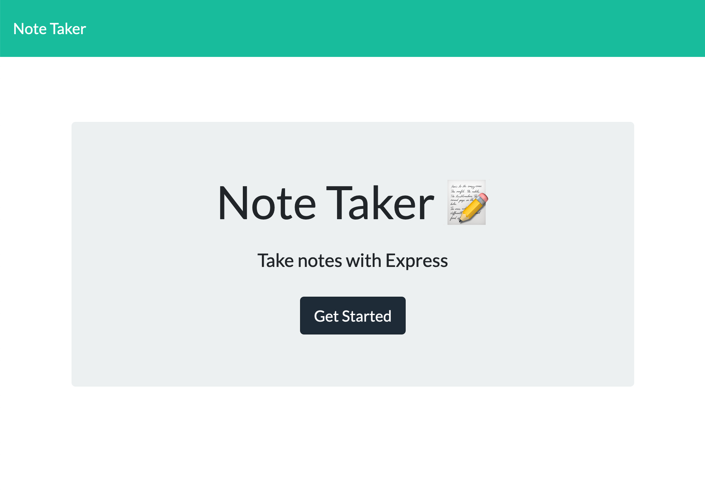
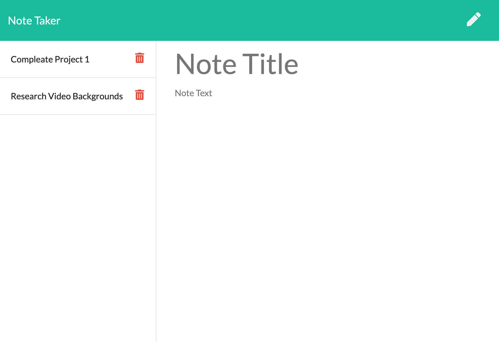

# NoteTakerWithHeroku
​Creating a Note Taking App Using Express

### Live site at [NoteTakerWithHeroku](https://afternoon-lake-66765.herokuapp.com/)
​
​For this project I created the backend code for saving notes for a predesigned note taking site. I used Heroku to host the site and Express with .get and .push commends to allow for data pulls.  

## Key Features
* back end hosted on Heroku
* unique IDs generated for tasks using npm Uniqid
* landing page and notes page load from server
saved notes load on left side of page upon page open or note save
notes are saved in JSON

## Credits
​* Heroku
* Uniqid npm - Copyright (c) 2014-2019 Halász Ádám mail@adamhalasz.com
* Express npm - The original author of Express is TJ Holowaychuk - The current lead maintainer is Douglas Christopher Wilson
* Front End Code form Class
* Inquirer Copyright (c) 2012 Simon Boudrias
* License text curtesy of https://choosealicense.com/licenses/mit/
​
​
## License

Copyright (c) 2020 Catherine Sibley

Licensed under the MIT license.

Permission is hereby granted, free of charge, to any person obtaining a copy of this software and associated documentation files (the "Software"), to deal in the Software without restriction, including without limitation the rights to use, copy, modify, merge, publish, distribute, sublicense, and/or sell copies of the Software, and to permit persons to whom the Software is furnished to do so, subject to the following conditions:

The above copyright notice and this permission notice shall be included in all copies or substantial portions of the Software.

THE SOFTWARE IS PROVIDED "AS IS", WITHOUT WARRANTY OF ANY KIND, EXPRESS OR IMPLIED, INCLUDING BUT NOT LIMITED TO THE WARRANTIES OF MERCHANTABILITY,
FITNESS FOR A PARTICULAR PURPOSE AND NONINFRINGEMENT. IN NO EVENT SHALL THE
AUTHORS OR COPYRIGHT HOLDERS BE LIABLE FOR ANY CLAIM, DAMAGES OR OTHER
LIABILITY, WHETHER IN AN ACTION OF CONTRACT, TORT OR OTHERWISE, ARISING FROM, OUT OF OR IN CONNECTION WITH THE SOFTWARE OR THE USE OR OTHER DEALINGS IN THE SOFTWARE.